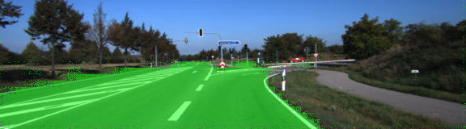

# Semantic Segmentation

### Introduction
In this project, the pixels of a road in images is labeled using a Fully Convolutional Network (FCN).

### Setup
##### Frameworks and Packages
Make sure you have the following is installed:
 - [Python 3](https://www.python.org/)
 - [TensorFlow](https://www.tensorflow.org/)
 - [NumPy](http://www.numpy.org/)
 - [SciPy](https://www.scipy.org/)
##### Dataset
Download the [Kitti Road dataset](http://www.cvlibs.net/datasets/kitti/eval_road.php) from [here](http://www.cvlibs.net/download.php?file=data_road.zip).  Extract the dataset in the `data` folder.  This will create the folder `data_road` with all the training a test images.

### What this does

1. This code downloads a pre-trained VGG16 model and extract the input, keep probability, layer 3, layer 4 and layer 7 from it (method load_vgg).

2. Those layers are used to create FCNs network to label the road in image. The detail of the network follows.
 - One convolutional layer with kernel 1 from VGG's layer 7
 - One deconvolutional layer with kernel 4 and stride 2 from the first convolutional layer
 - One convolutional layer with kernel 1 from VGG's layer 4
 - The two layers above are added to create the first skip layer
 - One deconvolutional layer with kernel 4 and stride 2 from the first ship layer
 - One convolutional layer with kernel 1 from VGG's layer 3
 - The two layers above are added to create the second skip layer
 - One deconvolutional layer with kernel 16 and stride 8 from the second skip layer
 - Every created convolutional and deconvolutional layer use a random-normal kernel initializer (std 0.01) and a L2 kernel regularizer with 0.001 to avoid overfitting.

3. The optimizer and the cross-entropy lost is defined on the optimize method using Adam optimizer.

4. The network is trained using the train_nn using keep probability 0.5 and learning rate 0.00001. The epoch is chosen to be 20 for early stopping. Batch size is 5.

### Performance
The peformance of log loss is shown in this figure.


The peformance of the label with image example is shown in next figures. (randomly chosen)
The road is faily covered within image.





### Run
Run the following command to run the project:
```
python main.py
```
